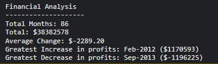

# Console Finances

## Description
As part of my Bootcamp course, we were challenged to use JavaScript to sort finances and print the results in the console of Dev Tools. 

The activity presents a real-world situation where we need to use our JavaScript skills to help analyse the financial records of a company. Below is the acceptance crtieria given:

```
You have been given a dataset composed of arrays with two fields, Date and Profit/Losses.

Your task is to write JavaScript code that analyzes the records to calculate each of the following:

* The total number of months included in the dataset.

* The net total amount of Profit/Losses over the entire period.

* The average of the **changes** in Profit/Losses over the entire period.
  * You will need to track what the total change in profits are from month to month and then find the average.
  * (`Total/Number of months`)

* The greatest increase in profits (date and amount) over the entire period.

* The greatest decrease in losses (date and amount) over the entire period.

When you open your code in the browser your resulting analysis should look similar to the following:

    Financial Analysis
    ----------------------------
    Total Months: 25
    Total: $2561231
    Average  Change: $-2315.12
    Greatest Increase in Profits: Feb-2012 ($1926159)
    Greatest Decrease in Profits: Sep-2013 ($-2196167)

Your final code should print the analysis to the console.
```
## Learning Points
This was my second JavaScript project and I found this to be quite challenging. There are of course lots of ways to solve problems and I'm sure there would have been a much simplier way of doing this, however with previous learning of JavaScript I knew it would be possible to split out the financial values into a separate array to calculate the total. Which is the route I decided to take. I do think this could have been achieved with a loop, that added the values together each increment but I couldn't get it to work. 

I found the map, reduce and sort methods to be really helpful and can imagine they will be used time and again for various problems that will need solving. 

To get the correct format for the console log print, I had to create a couple of variables, I think in future that would be another area I would want to slim down and make much more simple. 

## Useful information
The page is deployed on GitHub - [Click here](https://rbrd87.github.io/console-finances)

The repository of the project is also hosted on GitHub - [Click here](https://github.com/rbrd87/console-finances)

## Screenshots

Here is a snippet of my JavaScript code


And here is the result in the console



## Installation
Please follow the steps below to access code and install the project:

1. Navigate to https://github.com/rbrd87/console-finances
2. Above the list of files, click on green 'Code' button.


3. Copy the URL for the repository.
* To clone the repository using HTTPS, under the 'HTTPS' tab, click the copy icon.
* Alternatively you can clone the respository using a password-protected SSH key. To do so, use the SSH tab and copy the URL there
* Finally there is an option to clone the repository using GitHub CLI, click on the 'GitHub CLI' tab and then click copy icon. 

4. Open the Terminal
5. Navigate to the directory that you want the repository folder cloned to
6. Type `git clone`, and then paste the URL you copied earlier. e.g.

`$ git clone https://github.com/rbrd87/console-finances.git`

7. Press Enter - this will create a local copy of the repository

To view the financial analysis in the console you will need to open the `index.html` file with 'Live Server' found [here](https://marketplace.visualstudio.com/items?itemName=ritwickdey.LiveServer) or a similar VS Code extension, when the browser is open, press F12 to view the 'Dev Tools'. Navigate to the 'Console' section and you will see the information that was printed to the console. 